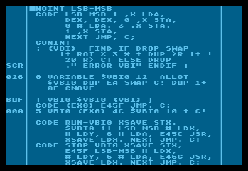

# GAM-FORTH and other fig-FORTH sources by Roland Pantoła

This repository features Roland Pantoła's fig-FORTH work. It includes the original "GAM-FORTH" game development environment for Atari 800XL, based on a modified APX Extended fig-FORTH [*](disclaimer) although dependent only on its public domain "FIG" elements and the Assembler by [Bill Ragsdale](https://github.com/BillRagsdale). You can find more information about Roland here:
* [Wikipedia entry (🇵🇱)](https://pl.wikipedia.org/wiki/Roland_Panto%C5%82a)
* [Moby Games entry (🇪🇳)](https://www.mobygames.com/person/483332/roland-panto%C5%82a/)

With the generous offering from Mr. Pantoła to the [Polish Society for Preserving the Technical Heritage (🇵🇱)](https://ptodt.org.pl/about/), GAM-FORTH sources are published here with his approval.

Main elements of GAM-FORTH are Forth enhancements, source code Editor and a complex GRAF package (able to convert and process graphics made in [RAMbrandt](https://github.com/savetz/RAMbrandt)). 

EDYTOR-FORTH (source Editor), previously published in "Tajemnice Atari":

GRAF, here in one if its modules:

GRAFIK-DOS (graphics storage routines):

This unique environment was used to develop 8-bit games: 
  - "A.D. 2044" (1991, 🇵🇱) - see the gameplay on [A.D. 2044 - Atari XL/XE by gregok1973 (🇵🇱)](https://www.youtube.com/watch?v=BUFI9YIeCvc). 
  - "Klątwa"/"The Curse" (1992, 🇵🇱/🇪🇳) - see the gameplay on [Klątwa for the Atari 8-bit family by Highretrogamelord (🇵🇱)](https://www.youtube.com/watch?v=ygqf9H5aB2k).
  - "Władcy Ciemności" (1993, 🇵🇱) - see the gameplay on [Władcy Ciemności - RetRozrywka GamePlay by RetRozrywka (🇵🇱)](https://www.youtube.com/watch?v=yMG_Y_y1VSs).

These games are copyrighted by [LK Avalon](https://www.lkavalon.com/), reeditions may be available at [Retronics](https://retronics.eu/). Related sources are NOT available here.

"Klątwa" and "Władcy Ciemności" were also ported to Commodore C-64.

The original 5.25" floppy disks were digitized by Trub.

Review, source selection and README by BartGo.

## Index

| #  |  File           | Name and Description                             |Content|
| -- | ----------     | -----------                                      |----|
| 01 | dev/09_A_Forth.* | **FORTH+EDITOR 1.6 / COM** - dev environment|⚙️ 📝|
| 02 | dev/09_B_Ekrany.* | **FORTH+EDITOR 1.6 / EKRANY** - related sources|🎞️ 📝|
| 03 | dev/11_A_Graf.* | **GRAF: COM** - resource manager and editor|⚙️ 📝|
| 04 | dev/11_B_Graf.* | **GRAF: EKRANY** - resource manager and editor|🎞️ 📝|
| 05 | dev/42_A_GrafDos.*   | **GRAF-DOS 2.05 / RAMB-KASETA** - resource conversion|⚙️ 🚫|
| 06 | dev/42_B_GrafDos.*   | **GRAF-DOS 2.05 / RAMB-KASETA** - resource conversion|🎞️ 📝|
| 07 | game/01_A_IronNappy.* | **IRON NAPPY** - game concept, sources ("screens")   |🎞️ 📝|

All floppy images are in the ATR format, together with LOG files. 

The above Emojis mean:
* ⚙️ - a bootable ATR image with compiled code
* 🎞️ - a non-bootable ATR image with Forth "screens" (source code)
* 📝 - sources from "screens" converted into the TXT format (omitting special ATASCII characters and binary data)
* 🖨️ - sources from "screens" converted into the PDF format (preserving special ATASCII characters and binary data)
* 🚫 - no sources on this medium

Please note that "screens" are a Forth-specific way to store sources on a floppy and an alternative to filesystem. Sources stored in this way were here converted to allow more convenient browsing and analysis. Still, the "screen" concept cannot be abandoned - sources had to be also provided on the floppy images (ATR) to preserve the original structure and behavior.

## Disclaimer

The original APX Extended fig-Forth can be obtained on [Atari Archives](https://www.atariarchives.org/APX/showinfo.php?cat=20029) - APX20029.DCM file is the best one. As described on the site, it is free to download and use, but is not public domain.
The closest public domain Forth would be "S*P*A*C*E Forth" ("s*p*a*c*e fig4th 1.1" by the same author, Patrick L. Mullarky), available from ABBUC as [0220 - Fig-Forth V1.1](https://abbuc.de/download/abbuc_pd_005_0201-0250/#) - it should be possible to port many elements of the environment there (and perhaps to other fig-FORTHs for Atari, especially Team Atari Forth). Usage of sources and description of many functionalities will be documented on the Wiki.

<!--
* ✅ - available
* 🔜 - upcoming
* 📚 - game - resources (e.g. text, graphics)
* 🗻 - Atari 8-bit
* 🌈 - Commodore C-64 -->

