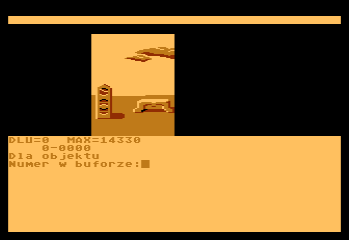

# fig-FORTH Work by Roland Pantoła

This repository features Roland Pantoła's fig-FORTH work. You can find more information about him here:
* [Wikipedia entry (🇵🇱)](https://pl.wikipedia.org/wiki/Roland_Panto%C5%82a)
* [Moby Games entry (🇪🇳)](https://www.mobygames.com/person/483332/roland-panto%C5%82a/)

The repository contains the original "GAM-FORTH" game development environment for Atari 800XL, based on a modified APX Extended fig-FORTH but dependent mostly on its public domain "FIG" core and the Assembler by [Bill Ragsdale](https://github.com/BillRagsdale).

"GAM-FORTH" sources have been generously offered by Mr Pantoła to the "Polish Society for Preserving the Technical Heritage" for release to the wider Forth and Atari communities. 

Main elements of GAM-FORTH are Forth enhancements, source code Editor and a complex GRAF package (able to convert and process graphics made in [RAMbrandt](https://github.com/savetz/RAMbrandt)). 

EDYTOR-FORTH (source Editor), previously published in "Tajemnice Atari":

GRAF, here in one if its modules:

This unique environment was used to develop 8-bit games: 
  - "A.D. 2044" (1991, 🇵🇱) - see the gameplay on [A.D. 2044 - Atari XL/XE by gregok1973 (🇵🇱)](https://www.youtube.com/watch?v=BUFI9YIeCvc). 
  - "Klątwa"/"The Curse" (1992, 🇵🇱/🇪🇳) - see the gameplay on [Klątwa for the Atari 8-bit family by Highretrogamelord (🇵🇱)](https://www.youtube.com/watch?v=ygqf9H5aB2k).
  - "Władcy Ciemności" (1993, 🇵🇱) - see the gameplay on [Władcy Ciemności - RetRozrywka GamePlay by RetRozrywka (🇵🇱)](https://www.youtube.com/watch?v=yMG_Y_y1VSs).

These three games are copyrighted by [LK Avalon](https://www.lkavalon.com/), reeditions may be available at [Retronics](https://retronics.eu/). Sources of these games are NOT available here.

"Klątwa" and "Władcy Ciemności" were also ported to Commodore C-64.

The original 5.25" floppy disks were digitized by Trub.

## Index

| #  | Type  |  Name          | Name and Description                             | Platform    |
| -- |------ | ----------     | -----------                                      | ----------- |
| 01 |🛠️💾⚙️📝| dev/09_A_Forth.* | **FORTH+EDITOR 1.6** - dev environment (compiled) | 🗻 |
| 02 |🛠️💾📝| dev/09_B_Ekrany.* | **EKRANY 1.6** - related sources (screens) | 🗻 |
| 03 |🛠️💾⚙️📝| dev/11_A_Graf.* | **GRAF: COM** - Forth Graphics Tools (compiled)     | 🗻 |
| 04 |🛠️💾📝| dev/11_B_Graf.* | **GRAF: EKRANY** - Forth Graphics Tools, sources (screens)  | 🗻 | 
| 05 |🕹️💾📝| game/01_A_IronNappy.* | **IRON NAPPY: EKRANY** - game concept, sources (screens)   | 🗻 |

* 🛠️ - development tool(s)
* 💾 - floppy image in the ATR format (marked with ⚙️ whenever bootable), together with LOG files
* 🕹️ - game - sources or executable (also game concepts or prototypes)
* 📝 - sources in the TXT format (less reliable - omitting special ATASCII characters and binary data)
* 🖨️ - sources in the PDF format (more reliable - preserving special ATASCII characters and binary data)
* ✅ - available
* 🔜 - upcoming
* 🗻 - Atari 8-bit

<!--
| 06 |🛠️💾⚙️ | dev/42_A_GrafDos.*   | Forth Graphics: Conversion (RamBrandt-Forth-DOS)   | 🗻 |
| 07 |🛠️💾📝🖨️| dev/42_B_GrafDos.*   | Forth Graphics: Conversion (RamBrandt-Forth-DOS) | 🗻 |

* 📚 - game - resources (e.g. text, graphics)
<!-- * 🌈 - Commodore C-64 -->

<!-- 
## Licensing Information

This project contains various components, each with its own licensing terms.
Please consult the `LICENSE` file within each respective directory for details.
-->
