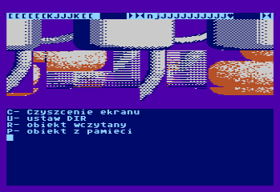
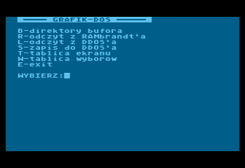
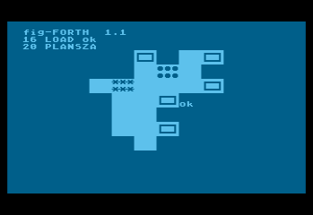

# GAM-FORTH and other fig-FORTH sources by Roland Pantoła

This repository features Roland Pantoła's fig-FORTH work for Atari 800XL and includes modification of the language ("GAM-FORTH") together with other custom development tools.

With the generous offering from Mr. Pantoła to the [Polish Society for Preserving the Technical Heritage (🇵🇱)](https://ptodt.org.pl/about/), the sources are published here with his approval.

You can find more information about Roland here:
* [Wikipedia entry (🇵🇱)](https://pl.wikipedia.org/wiki/Roland_Panto%C5%82a)
* [Moby Games entry (🇪🇳)](https://www.mobygames.com/person/483332/roland-panto%C5%82a/)

You can find more information about Forth here:
* [Wikipedia entry (🇪🇳)](https://en.wikipedia.org/wiki/Forth_(programming_language))
* [Forth: The programming language that writes itself (🇪🇳)](https://ratfactor.com/forth/the_programming_language_that_writes_itself.html)

The original 5.25" floppy disks were digitized by Trub.

Review, source selection and this README by BartGo.

## Index

| #  |  Files          | Name and Description                             |Download|
| -- | ----------     | -----------                                      |----|
| 01 | img/09_A_Forth.* | **FORTH+EDITOR 1.6 / COM** - GAM-FORTH|[⚙️](img/09_A_Forth.ATR) [📝](img/09_A_Forth.TXT)|
| 02 | img/09_B_Ekrany.* | **FORTH+EDITOR 1.6 / EKRANY** - GAM-FORTH|[🎞️](img/09_B_Ekrany.ATR) [📝](img/09_B_Ekrany.TXT)|
| 03 | img/11_A_Graf.* | **GRAF: COM** - resource manager and editor|[⚙️](img/11_A_Graf.ATR) [📝](img/11_A_Graf.TXT)|
| 04 | img/11_B_Graf.* | **GRAF: EKRANY** - resource manager and editor|[🎞️](img/11_B_Graf.ATR) [📝](img/11_B_Graf.TXT)|
| 05 | img/42_A_GrafDos.*   | **GRAF-DOS 2.05 / RAMB-KASETA** - resource conversion|[⚙️](img/42_A_GrafDos.ATR) 🚫|
| 06 | img/42_B_GrafDos.*   | **GRAF-DOS 2.05 / RAMB-KASETA** - resource conversion|[🎞️](img/42_B_GrafDos.ATR) [📝](img/42_B_GrafDos.TXT)|
| 07 | img/01_A_IronNappy.* | **IRON NAPPY** - an early game concept|[🎞️](img/01_A_IronNappy.ATR) [📝](img/01_A_IronNappy.TXT)|

All the floppy images are in the ATR format, usually accompanied by LOG files. 

The above emojis mean:
* ⚙️ - a bootable ATR image with compiled code
* 🎞️ - a non-bootable ATR image with Forth "screens" (source code)
* 📝 - sources from "screens" converted into the TXT format (omitting special ATASCII characters and binary data)
* 🖨️ - sources from "screens" converted into the PDF format (preserving special ATASCII characters and binary data)
* 🚫 - no sources on this medium

Please note that "screens" are a Forth-specific way to store sources on a floppy (as an alternative to files) and are here converted for more convenient usage. Still, the "screen" concept cannot be abandoned completely - sources are best to be also provided on the floppy images (ATR) to preserve the original structure.

## What are these applications?

EDYTOR-FORTH (source editor for Forth "screens"):

This program is already known from the Polish magazine "Tajemnice Atari" ("Atari Secrets") and was described there in 1992-93 Forth course.

GRAF (resource manager), here in one if its submodules:

GRAFIK-DOS (graphics conversion and storage routines):

IRON NAPPY (board generator for an abandoned game concept):

All these tools were dependent mostly on the public domain "FIG" implementation of Forth and on its Assembler written by [Bill Ragsdale](https://github.com/BillRagsdale), but actually written in APX Extended fig-FORTH (originally distributed by Atari). Today APX Forth can be officially obtained on [Atari Archives](https://www.atariarchives.org/APX/showinfo.php?cat=20029), APX20029.DCM being the most suitable file. As described on the site, it is free to download and use, but is not public domain. It is the most compatible fig-FORTH version to be used with the sources. Probably the second in compatibility is public domain SPACE Forth, written by the same author as the APX version - Patrick L. Mullarky.

## Were these Forth tools ever used to develop any applications or games?

Three commercially succesful 8-bit games were developed using these tools: 
  - "A.D. 2044" (1991, 🇵🇱) - see the gameplay on [A.D. 2044 - Atari XL/XE by gregok1973 (🇵🇱)](https://www.youtube.com/watch?v=BUFI9YIeCvc). 
  - "Klątwa"/"The Curse" (1992, 🇵🇱/🇪🇳) - see the gameplay on [Klątwa for the Atari 8-bit family by Highretrogamelord (🇵🇱)](https://www.youtube.com/watch?v=ygqf9H5aB2k).
  - "Władcy Ciemności" (1993, 🇵🇱) - see the gameplay on [Władcy Ciemności - RetRozrywka GamePlay by RetRozrywka (🇵🇱)](https://www.youtube.com/watch?v=yMG_Y_y1VSs).

These games are copyrighted by [LK Avalon](https://www.lkavalon.com/), reeditions may be available at [Retronics](https://retronics.eu/). Related sources are NOT available here.

"Klątwa" and "Władcy Ciemności" were also ported to Commodore C-64.

<!-- The closest public domain Forth seems to be "S*P*A*C*E Forth" ("s*p*a*c*e fig4th 1.1" by the same author, Patrick L. Mullarky), available from ABBUC as [0220 - Fig-Forth V1.1](https://abbuc.de/download/abbuc_pd_005_0201-0250/#) - it should be possible to port many elements of the environment there (and perhaps to other fig-FORTHs for Atari, especially Team Atari Forth). Usage of sources and description of many functionalities will be documented on the Wiki.
-->

<!--
* ✅ - available
* 🔜 - upcoming
* 📚 - game - resources (e.g. text, graphics)
* 🗻 - Atari 8-bit
* 🌈 - Commodore C-64 -->

